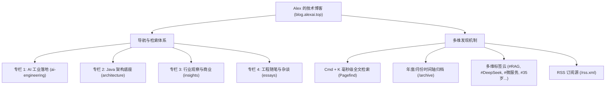
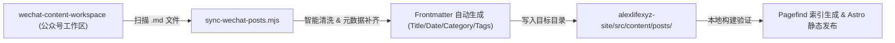

# 长期技术博客系统架构设计与 100+ 篇公众号存量迁移规划
# (Long-term Technical Blog Architecture & Content Migration Plan)

> **项目愿景**：将现有站点文章模块从“个人履历的附属展示”，正式升级为**“Alex 的独立数字花园（Digital Garden）与技术 IP 长期自留地”**。承接公众号现存的 100 篇左右优质文章，并建立持续更新、极速检索、分类严整、自动同步的长期运营闭环。

---

## 一、战略定位与核心受众画像

### 1. 战略定位：双核数字资产
* **主站控制台 (`alexai.top`)**：聚焦**职场背景调查、高管/猎头初筛、在线生产系统（RAG Lab & Chat Assistant）与量化履历 PDF 导出**，讲求“60 秒内建立极强信任”。
* **技术专栏空间 (`blog.alexai.top` / `/writing`)**：聚焦**深度技术沉淀、时代与行业思考、个人认知演进与极客技术交流**，讲求“长尾技术影响力、高留存沉浸阅读与公众号引流”。

### 2. 内容双重属性（为什么这个博客具备巨大黏性？）
* **硬核技术厚度**：11 年 Java 真实生产沉淀、平安 20 万 QPS 统一认证高可用、国网微服务脚手架、联想自动化运维、Java 21 + DeepSeek 工业级 RAG 落地（带 ACL 权限隔离与防幻觉拒答）；
* **人文与时代共鸣**：公众号中沉淀的 35 岁老 Java 转型心路、大模型时代的个人生存思考、养家与生活平衡、技术学得慢反而扎实的经验。

---

## 二、信息架构与分类体系（承接 100+ 篇内容）

当文章突破百篇规模，平铺列表会导致严重的读者迷失。必须采用**“专栏分类（粗粒度）+ 标签云（细粒度）+ 时间轴归档（历史沉淀）”**的三维导航网格：



### 1. 四大核心专栏（Categories）划分

| 专栏 Identifier | 专栏中文名 | 定位与核心选题范例 | 对应受众 |
| :--- | :--- | :--- | :--- |
| `ai-engineering` | **AI 工业落地** | 聚焦 RAG、Agent、DeepSeek、Function Calling、Token 成本优化、向量检索、ACL 权限隔离等实战。 | AI 应用开发者、技术选型者、大厂同行 |
| `architecture` | **Java 架构底座** | 平安 20 万 QPS 统一认证高可用、国网微服务脚手架设计、联想自动化运维、并发治理、JVM 性能调优。 | 资深后端、架构师、技术 VP |
| `insights` | **行业观察与思考** | *《连 Copilot 都开始按 Token 算钱了》*、*《OpenAI 和 Anthropic 都下场做实施了》*、*《黄仁勋说 AGI 已至》*等。 | 科技爱好者、技术管理者、投资/分析视角 |
| `essays` | **工程随笔与生活** | *《聊了这么久 AI 我还是得养家》*、*《学得慢一点反而没那么容易白学》*、*《35岁老Java为什么在琢磨AI应用》*。 | 广大开发者、同龄职场人、长期读者 |

### 2. 多维标签系统（Tags）
交叉维度索引，支持通过 `/tags/[tag]` 快速聚合：
* **技术栈标签**：`#Java` `#Spring` `#DeepSeek` `#RAG` `#微服务` `#向量数据库` `#Docker`
* **工程方法标签**：`#高可用` `#权限隔离` `#重排算法` `#FunctionCalling` `#系统设计`
* **主题思考标签**：`#35岁` `#职场转型` `#生活思考` `#写作沉淀`

---

## 三、页面布局与视觉交互蓝图

### 1. 博客主页（The Blog Hub）布局

```
+-----------------------------------------------------------------------------------+
|  [Brand] 何占伟 / Alex       [专栏]  [归档]  [标签]  [主站/履历]  [🔍 / Cmd+K] [☀️/🌙]  |
+-----------------------------------------------------------------------------------+
|                                                                                   |
|  HERO 区域:                                                                       |
|  Alex 的技术自留地 & 数字花园                                                      |
|  11 年 Java 后端 · 记录 AI 时代下的工程实战、架构演进与真实生活思考。                    |
|                                                                                   |
|  [ 🔍 快速检索 100+ 篇文章与代码... (按 / 键直接唤起) ]                            |
|                                                                                   |
+-----------------------------------------------------------------------------------+
|  🔥 必读精选 (Featured / Pinned - 3 篇大卡片排版)                                  |
|  +---------------------------+ +---------------------------+ +------------------+ |
|  | [AI 工业落地]              | | [Java 架构实战]           | | [精选随笔]       | |
|  | Java 21 混合检索 RAG 实战   | | 平安 20 万 QPS 统一认证   | | 聊了这么久 AI    | |
|  | BM25+向量召回/真实引用对齐  | | 2000+ 子系统高可用演进... | | 我还是得养家     | |
|  +---------------------------+ +---------------------------+ +------------------+ |
+-----------------------------------------------------------------------------------+
|  专栏筛选 Tabs:                                                                   |
|  [ 全部 (100+) ]  [ AI 工业落地 ]  [ Java 架构 ]  [ 行业观察 ]  [ 随笔生活 ]        |
|                                                                                   |
|  视图切换: [ 🗂️ 图文摘要卡片 ]  [ 📋 紧凑列表清单 ]                               |
|                                                                                   |
|  文章主流 (按年份倒序分块):                                                        |
|  2026 -------------------------------------------------------------------------   |
|  · 09-08  Java 21 企业级混合检索 RAG 实战：BM25 + 向量召回与防幻觉拒答    [AI 工程] |
|  · 05-13  OpenAI 和 Anthropic 都下场做实施了                             [行业观察] |
|  · 05-09  聊了这么久 AI 我还是得养家                                     [工程随笔] |
|  · 05-05  连 Copilot 都开始按 Token 算钱了                               [行业观察] |
|  · 03-27  35岁老Java为什么在琢磨AI应用                                   [工程随笔] |
|  ... (支持分页或展开更多)                                                         |
|                                                                                   |
|  右侧辅助栏 (Desktop):                                                            |
|  +--------------------------------------------------+                             |
|  | 作者卡片: 何占伟 / 成都 / 11年开发               |                             |
|  | 关注公众号: [公众号二维码卡片 & 微信 ID]          |                             |
|  | 热门标签云: #RAG #DeepSeek #微服务 #高并发 ...   |                             |
|  | RSS 订阅: [/rss.xml 订阅源]                      |                             |
|  +--------------------------------------------------+                             |
+-----------------------------------------------------------------------------------+
```

### 2. 文章详情页（Immersive Reader）体验升级
在现有的优秀阅读器基础上增加以下闭环元素：
* **阅读信息条**：顶部阅读进度条、面包屑导航（`博客 > AI 工业落地 > 正文`）、字数、阅读时长、更新日期。
* **侧边大纲**：右侧 Sticky TOC 悬浮目录，随读者阅读自动滚动高亮。
* **代码块增强**：右上角一键复制代码（已实现）+ 语言标识徽章。
* **文末行动号召（CTA）卡片**：
  * **微信公众号专属名片**：包含公众号头像、名称、Slogan 与高清二维码，方便读者一键长按扫码关注；
  * **同专栏 / 同标签延伸推荐**：自动关联计算 2 篇相关文章；
  * **上一篇 / 下一篇切换**；
  * **版权声明与分享**。

### 3. 全文检索体系（Pagefind 毫秒级离线搜索）
* 引入现代静态站标准的 **Pagefind** 搜索引擎；
* **优势**：
  * 构建期自动在本地生成高压缩的 WASM 倒排索引；
  * 运行时完全在浏览器端秒级检索，**0 云端服务器依赖、0 额外开销**；
  * 支持中英文分词、关键词高亮匹配和上下文字段摘录。
* 交互：键盘按 `Cmd + K` 或 `/` 快捷键瞬间弹出搜索浮层。

### 4. 独立时间轴归档页（`/archive`）
* 以紧凑极简的时间树形式，按“年份 - 月份”收拢展现所有 100+ 篇文章；
* 直观呈现 2024、2025、2026 持续写作与思考的历史厚重度。

---

## 四、100+ 篇公众号存量文章迁移与自动化同步方案

### 1. 现有资产分析
在你的本地目录 `/Users/mac/studio/20-content/wechat-content-workspace` 下：
* `published/` 目录存有 **39 篇** 已发布公众号文章；
* `drafts/` 目录存有 **51 篇** 优质草稿与成文，合计达 **90+ 篇**！

### 2. 自动化同步流水线（Sync CLI Tool）设计
为避免后续写公众号时“人工向博客搬砖”，专门构建一条 Node.js / ES Module 同步脚本：
`scripts/sync-wechat-posts.mjs`



#### 自动化处理逻辑：
1. **自动提取标题**：读取文件内第一个 `# ` 标题或从文件名中解析；
2. **自动提取发布日期**：解析文件名中的 `YYYY-MM-DD` 时间戳（如 `2026-05-09-...`）；
3. **智能归类专栏（Category）**：
   * 包含 `RAG`、`AI`、`Agent`、`Token`、`Sora` 等关键词 → 自动打标 `ai-engineering` 或 `insights`；
   * 包含 `Java`、`堆栈`、`架构`、`微服务` 等关键词 → 自动打标 `architecture`；
   * 包含 `焦虑`、`养家`、`学得慢`、`思考` 等关键词 → 自动打标 `essays`；
4. **排版格式规范化**：自动清除公众号专用的特殊 HTML 标签与多余空行，保持纯净 GitHub Flavored Markdown 规范；
5. **增量同步**：只更新有修改或新增的文章，已存在的文章不会覆盖手动调优过的 Frontmatter。

---

## 五、分阶段推进路线图（Implementation Roadmap）

```
+-----------------------------------------------------------------------------------+
| 阶段 1：Schema 升级与博客首页重构（第 1 天）                                       |
| - 升级 content/config.ts，新增 category、tags、featured、pinned 字段             |
| - 重构 /writing 页面：分类 Tab 栏、双视图切换、年度时间轴分块                    |
| - 创建标签聚合页 (/tags/[tag]) 与归档页 (/archive)                               |
+-----------------------------------------------------------------------------------+
                                         │
                                         ▼
+-----------------------------------------------------------------------------------+
| 阶段 2：存量百篇文章清洗与批量导入（第 2 天）                                       |
| - 编写 scripts/sync-wechat-posts.mjs 导入脚本                                     |
| - 将 wechat-content-workspace 中的 90+ 篇批量同步至 src/content/posts             |
| - 执行 npm run build 验证 100+ 篇静态编译性能与路由正确性                         |
+-----------------------------------------------------------------------------------+
                                         │
                                         ▼
+-----------------------------------------------------------------------------------+
| 阶段 3：全文检索、RSS 与文末引流闭环（第 3 天）                                    |
| - 集成 Pagefind 毫秒级客户端全文检索 (Cmd+K 搜索弹窗)                            |
| - 集成 @astrojs/rss 生成标准 /rss.xml                                            |
| - 文章末尾挂载公众号名片、二维码关注卡片与相关文章推荐                            |
+-----------------------------------------------------------------------------------+
                                         │
                                         ▼
+-----------------------------------------------------------------------------------+
| 阶段 4：独立域名绑定与双域直通（第 4 天）                                          |
| - 在 Cloudflare 中配置 blog.alexai.top 域名                                      |
| - 配置 Cloudflare Pages 边缘重写，使 blog.alexai.top 直接以博客大厅为首页入口     |
| - 全面验收与正式发布上线                                                         |
+-----------------------------------------------------------------------------------+
```

---

## 六、长期维护指引与写作心流

在整个体系搭建完毕后，你未来的写作体验将极为丝滑：
1. **公众号写作**：依然在你习惯的 `20-content/wechat-content-workspace` 中用 Obsidian 或 Markdown 自由书写；
2. **一键同步博客**：在命令行运行 `npm run sync:wechat`；
3. **自动发布**：Git 推送后，Cloudflare Pages 自动构建完成，`blog.alexai.top` 与 `alexai.top` 同步更新！
