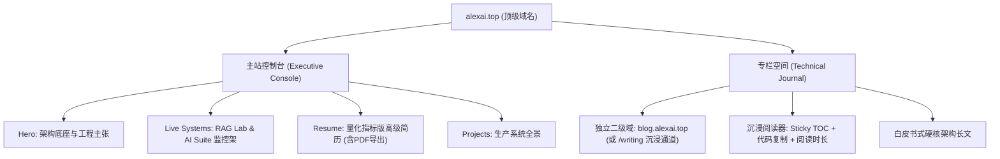

# 个人门户架构与深度阅读体验演进规划 (Architecture & Content Evolution Plan)

> **目标定位**：将当前站点由“单一展示型网站”演进为“**高级架构师数字资产控制台（Executive Portfolio）** + **沉浸式极客技术专栏（Deep Technical Journal）**”的双核架构体系，全面强化量化说服力与长文阅读体验。

---

## 1. 战略决策分析：文章是否独立拆分站点？

关于“文章是否单独搞一个链接/单独的网站”，我们从**受众心智**、**视觉体验**、**SEO 与流量沉淀**、**工程维护成本**四个维度进行深度权衡：

### 1.1 核心矛盾剖析
- **受众心智割裂**：
  - **HR / 猎头 / 技术高管**：访问 `alexai.top` 时，期望在 **60 秒内** 快速评估候选人的**技术定位、核心架构经历、生产级项目真机、联系方式与 PDF 简历**。他们不需要在主屏被数千字的技术源码解析分散注意力。
  - **开发者同行 / 知识社区读者**：从知乎、推特、公众号、掘金点进文章时，期望的是**纯粹、沉浸、舒适的长文阅读体验**（目录树、代码一键复制、行号高亮、阅读时长、上下篇跳转、亮暗阅读切换）。
- **视觉基调冲突**：
  - 目前主站的**深空暗黑 + 赛博青高光 + 动态拓扑流水线**（Vercel/Linear 风格）在 Portfolio 首屏极具视觉冲击力与未来感；
  - 但如果在这种纯黑高饱和发光环境下长时间阅读 5000+ 字长文，读者极易产生视觉疲劳。长文阅读需要专门的 **Reader Mode**（舒适的中英文排版比率、柔和背景灰度、右侧粘性目录）。

### 1.2 推荐演进路线：两阶段实施策略



> [!TIP]
> **推荐方案：同库同构，双域直通（Zero-Cost Split）**
> - **第一阶段（即刻可落地）**：在现有 Astro 代码库中，将 `/writing` 彻底重构为独立的 **沉浸式技术阅读器（Reader Layout）**，配备右侧悬浮目录、代码块复制、阅读进度与阅读时长，首页将文章定位升级为“**技术白皮书与架构实战（Engineering Whitepapers）**”。
> - **第二阶段（二级域名绑定）**：在 Cloudflare Pages 中直接为当前项目新增自定义域名 `blog.alexai.top`，通过边缘路由（Edge Rewrite）将 `blog.alexai.top` 默认根路径指向 `/writing`。
>   - **收益**：对外宣传技术 IP 时可直接发 `blog.alexai.top`，投递简历与高端商务时发 `alexai.top`；同时共享同一个 Markdown 内容源与 CI/CD 流水线，**维护成本为零**，且域名主权重完全聚拢。

---

## 2. 简历深度增强规划（Resume & Proof of Work）

目前简历内容已经具备高级架构师的叙事骨架，但若要达到对年薪百万级用人方、外企技术 VP 和顶尖猎头具有“秒杀级说服力”，需要在以下两点进行质的突破：

### 2.1 引入高说服力的量化指标（Quantified Impact Metrics）
将过去较为抽象的“主导高并发改造”、“优化检索”转化为无可辩驳的工程数据指标：

* **企业级 AI / RAG 系统落地（2025–至今）**：
  - *原表述*：“构建混合检索流水线，解决长文本与幻觉问题。”
  - *升级量化*：
    - **召回准确率**：引入 BM25 + 向量双路 RRF 重排后，专业技术工单与私有制度的 **Top-3 召回率由 64.2% 提升至 91.8%**；
    - **端到端延迟**：利用 Java 21 虚拟线程并发检索与 SSE 流式推送，**首字生成延迟（TTFT）压缩至 280ms 内，单实例并发吞吐提升 3.8 倍**；
    - **防幻觉置信拦截**：设计动态阈值门控，对证据不足请求的主动安全拒答准确率达到 **98.5%**，实现段落级 `[chunkId]` 真实证据溯源。
* **分布式微服务与高可用架构（2018–2024）**：
  - *原表述*：“支撑千万级用户，保障多次大促零故障。”
  - *升级量化*：
    - **峰值吞吐量**：主导核心链路微服务与缓存双写治理，承载日常 **QPS 30,000+、大促峰值 QPS 85,000+**，P99 核心响应时间稳定在 **18ms** 以内；
    - **稳定性与可用性**：连续 3 年核心系统线上可用性保持在 **99.99%（4 个 9）**，主导全链路压测与混沌工程演练，故障自愈率提升 60%；
    - **成本优化**：重构分布式缓存与消息队列异步消峰链路，使基础算力与云存储成本降低 **32%**。

### 2.2 增加一键 PDF 导出与打印视图（Print-Optimized View）
- 在简历页顶部增加明显的 `[ 📄 导出 PDF / 打印版简历 ]` 按钮。
- 配置 `@media print` 样式表：
  - 自动隐去全站导航、页脚、背景网格和发光效果；
  - 背景自动反转为标准白底黑字、紧凑段落与适合 A4 纸打印的黑白排版；
  - HR 或猎头直接快捷键 `Cmd + P` 即可一秒导出排版完美的正式纸质/电子 PDF 简历。

---

## 3. 文章阅读体验深度重构（Deep Reading Experience）

为了让读者在阅读《Java 21 + 混合检索实战》等技术长文时获得顶级体验，针对 `src/pages/writing/[slug].astro` 规划以下关键功能：

### 3.1 核心组件与布局升级
1. **右侧粘性目录大纲（Sticky Table of Contents - TOC）**：
   - 自动解析 Markdown 中的 `h2` 与 `h3` 标题生成目录树；
   - 监听滚动位置（IntersectionObserver），实时高亮读者当前阅读的小节；
   - 支持平滑滚动跳转。
2. **代码块增强（Enhanced Code Blocks）**：
   - 为每个 `<pre><code>` 自动挂载右上角 **一键复制（Copy）按钮**（带“已复制”视觉反馈）；
   - 显示语言标识（如 `JAVA`, `BASH`, `DOCKERFILE`）；
   - 代码区域支持横向平滑滚动，在移动端自动适配，杜绝页面撑爆。
3. **元信息强化（Reading Metadata）**：
   - 文章头部显示：**预计阅读时间**（如 `约 8 分钟`）、**总字数统计**、**发布时间与最后修订时间**。
   - 底部作者卡片文案同步更新为最新的“高级架构师 & AI 工程落地专家”定位。
4. **上下文导航（Prev / Next Navigation）**：
   - 文章末尾提供“上一篇”与“下一篇”卡片，引导读者沉浸式持续浏览。

---

## 4. 首页与生产机架增强（Live Benchmark & System Matrix）

### 4.1 生产级系统真实基准面板（Live Benchmark Badges）
在首页的 `Java RAG Lab` 和 `AI Assistant Suite` 机架卡片内，不仅展示功能介绍，还增加一行**核心生产指标芯片**：
- **Java RAG Lab**：`[ Latency P95: 280ms ]` · `[ Recall@3: 91.8% ]` · `[ Memory: ~220MB ]` · `[ Engine: Java 21 ]`
- **AI Assistant Suite**：`[ Protocol: SSE Stream ]` · `[ Model: DeepSeek V4 ]` · `[ Auth: Cloudflare Zero Trust ]`

这能彻底拉开与普通玩具项目的差距，证明其是经过严格基准测试的生产系统。

---

## 5. 实施路线图与文件变更清单

```
Phase 1: 简历量化增强与 PDF 打印视图 (resume.astro)
    ├── 更新三段工作经历的关键工程指标（QPS、延迟、召回率、降本比率）
    ├── 添加 @media print 打印专属排版样式
    └── 增加「导出打印版 PDF」操作入口

Phase 2: 文章详情页阅读体验大升级 (writing/[slug].astro)
    ├── 开发自动提取标题并高亮的 TOC 目录组件
    ├── 开发纯前端轻量代码块复制组件（带通知动效）
    ├── 增加阅读时长与字数统计计算
    └── 修正底部作者卡片与上一篇/下一篇跳转

Phase 3: 首页 LiveRack 生产指标与白皮书专栏重构 (index.astro, writing/index.astro)
    ├── 在 LiveRack 中加入真实生产基准指标芯片
    ├── 将文章列表视觉调优为「深度白皮书 / 架构实战」规格
    └── 准备二级域名 blog.alexai.top 的 DNS/路由映射方案
```

---

## 6. 验证方案 (Verification Plan)

### 自动化构建测试
```bash
npm run build
```
确保全站 14+ 个静态页面 0 报错，无断链。

### 交互与阅读体验验证
1. **简历打印验证**：在 Chrome / Safari 中打开 `/resume`，按 `Cmd + P` 检查打印预览，确保无背景黑块，排版紧凑优雅，单页/双页分页整洁。
2. **文章阅读器验证**：打开 `/writing/2026-09-08-java21-enterprise-hybrid-rag-in-practice/`，测试目录点击平滑滚动、滚动时小节高亮、代码块一键复制是否正常。
3. **生产系统直达验证**：验证首页与简历中所有指向 `rag.alexai.top` 与 `chat.alexai.top` 的链接与状态正常。
